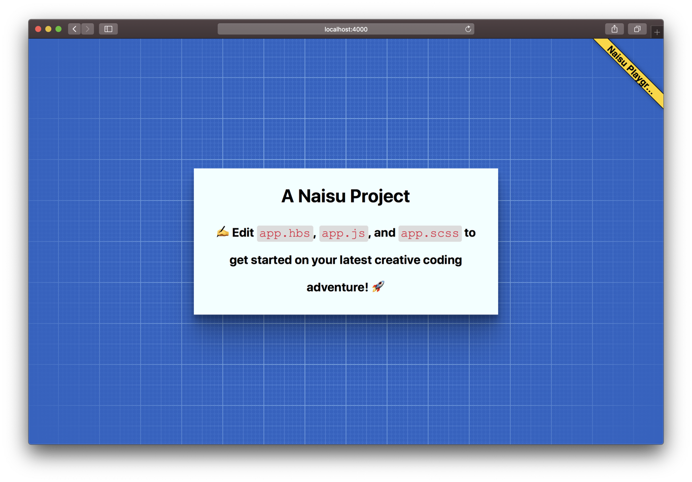

# Naisu Static Site Playground

A webpack-driven static site playground for local development of [codepen-esque](https://codepen.io) experiments.

## Usage

### Pre-requisites

1. Node >= 10
2. Yarn/NPM

### Getting started in development

1. Clone the repo
2. `yarn` or `npm install`
3. `yarn start`
4. Default app opens at `localhost:4000` (Live reloading enabled by default. HMR enabled by editing webpack config)
5. See 'Developing in your playground' below

### Building for production

1. `yarn build`
2. Static site output at `/dist`
3. Deploy to your favourite static site hosting service

### Developing in your playground

Static Site Playground is designed to be very simple. There are three main files provided for you to use in your creative coding experiments (found under `src/` folder):

1. `app.hbs`: this is your 'HTML' file. It's inserted into the body element. You can use standard HTML, but if you want to use the power of handlebars templating, feel free to define template partials, or invesigate `bootstrap.js` to see how to use dynamic partials with injected data.
2. `app.js`: this is your JS file.
3. `app.scsss`: this is your styles file. It uses SASS, so you can define partials, use mixins, and all the other powerful tools of the SASS pre-processor.

### Assets

- **Images**: put images in `static/assets/images` and import into CSS as `url()`, JS as `require()` or `import ...`, or HTML as `` and webpack will take care of copying/inlining you assets for the project
- **Fonts**: support pending
- **Videos**: support pending
- **Custom scripts**: put images in `static/assets/scripts` or `static/assets/scripts/vendor` and import in JS as `require()` or `import ...` or in HTML as `<script src="...">` and webpack (should) take care of bundling for your dev server/build

### Other useful files:

1. `/src/header.hbs`: add extra HTML (`<link>`,`<script>`,`<meta>`) content for the `<head>` of your HTML file
2. `src/_bootstrap.scss`: core styles used of the app label badge that appears in top right of your app
3. `./.env.sample`: The sample envs are injected and used in the raw HTML as meta tags, and as the app label that appears in the top right
4. `./bootstrap.js`: Used to import supporting assets (app.scss, etc) for webpack build

## Project details

### Motivation

[Codepen.io](https://codepen.io) is a highly convenient website for creating, sharing, and viewing code experiments and creative coding adventures. However, it's limited in some respects (depends on internet connection, limited in size of data, can't easily browser dev tools due to iFrame embedding, etc).

I think there is a missing 'local development' solution for rapidly creating coding prototypes for when either internet is spotty, or I want to debug easily, or I want to save and reload much faster than online solutions allow.

### Design goals

- [x] Live server / hot reloading in development
- [x] Simple tech stack: vanilla JS | sass stylesheets | plain HTML
- [x] Branchable/forkable app template that can be extended / enhanced as you see fit
- [x] Reliable build task for production environments that can be deployed to surge / netlify / static site hosting
- [x] support for serving custom assets: images with optimization
- [ ] support for serving custom assets: fonts
- [ ] support for serving custom assets: videos
